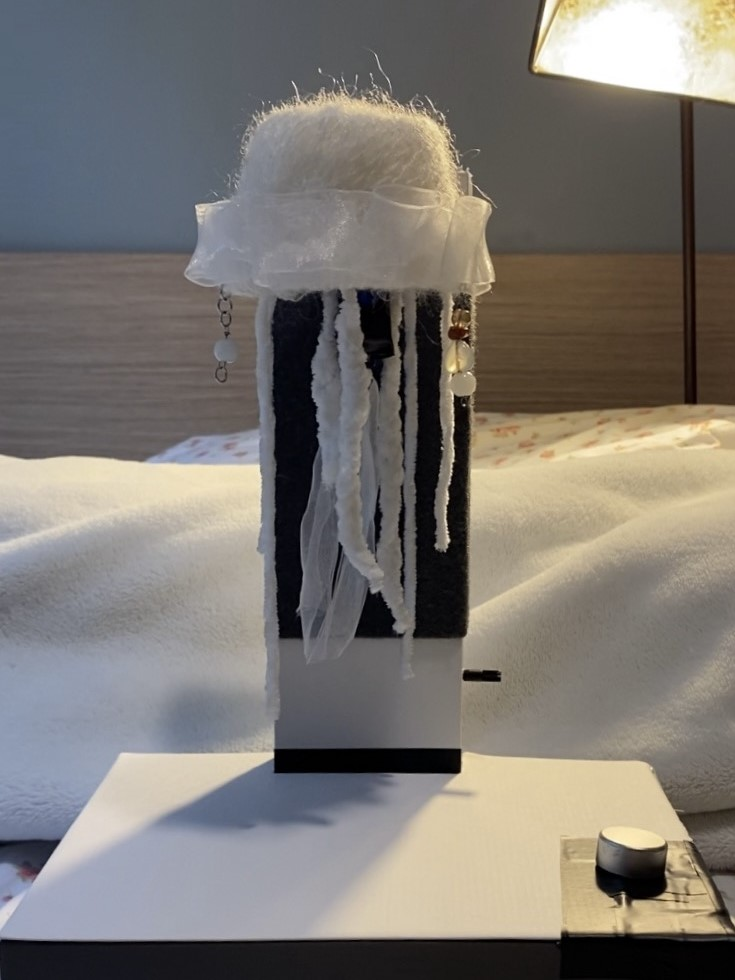

# Jellyfish-Night-Light-Prototype
Jellyfish-themed interactive night light prototype, made with lo-fi materials, created for Assignment 1 in [CSE 493F](https://courses.cs.washington.edu/courses/cse493f/)

Working with hardware for the first time was an awesome experience! Key components of my project included the Arduino Leonardo, photoresistors, servo motor, and RGB LED. I'm excited to gain more experience with electronics as this quarter progresses (´◡`)

## Final Theme and Night Light Prototype

    
    
    

